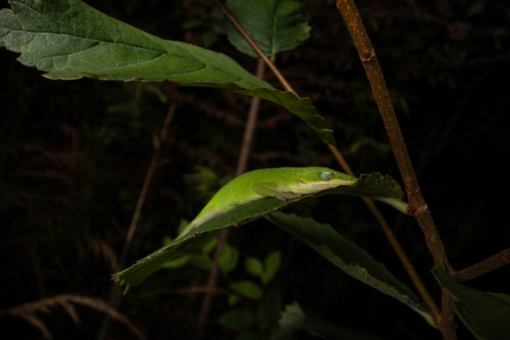
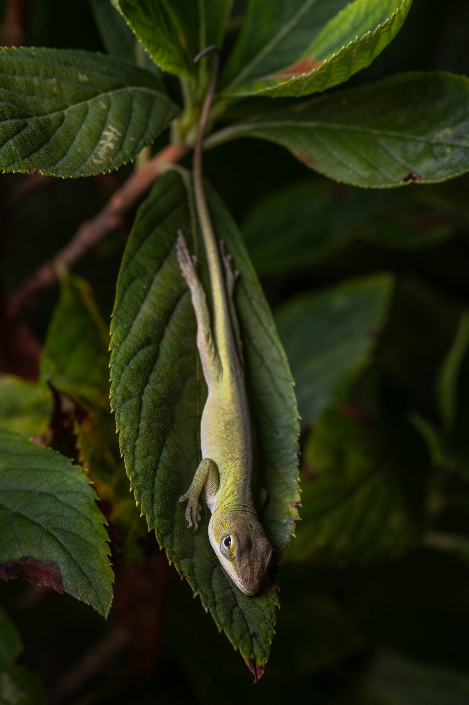
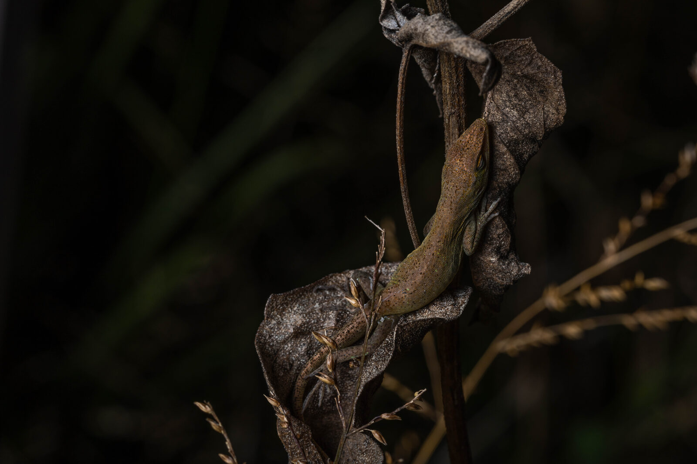
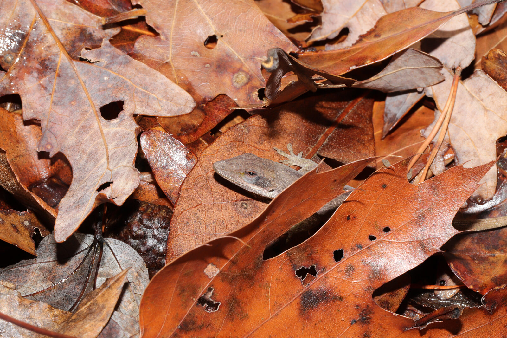
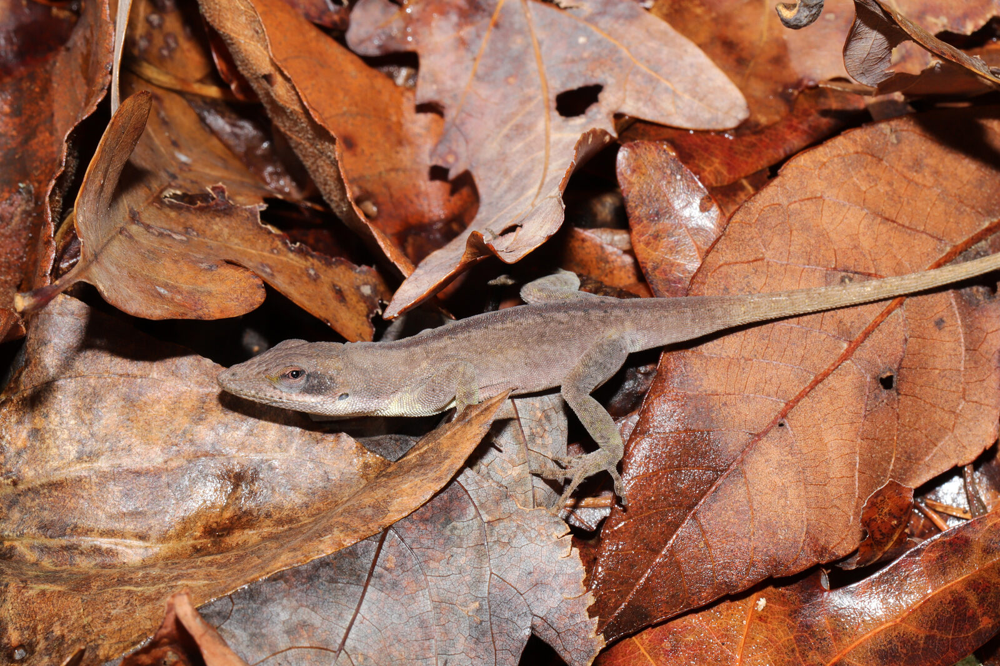
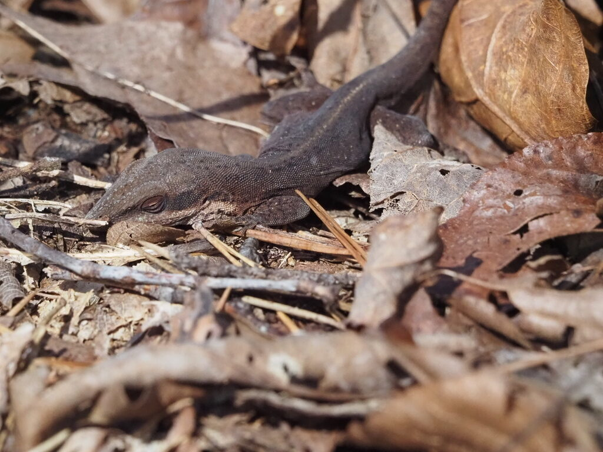
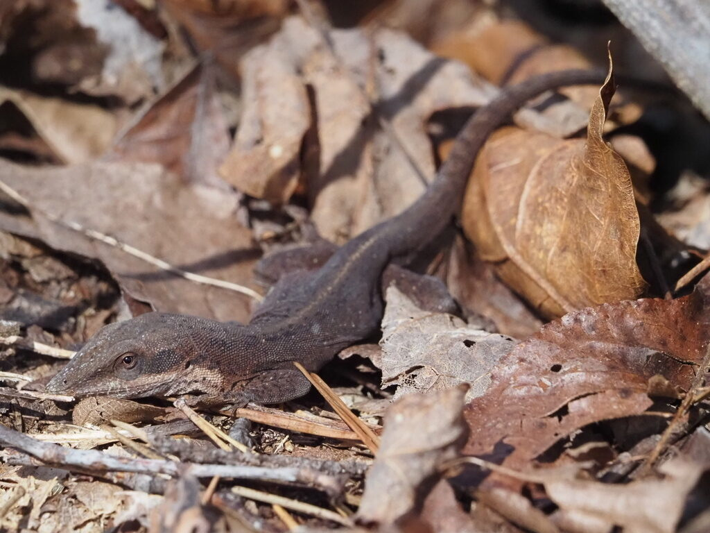
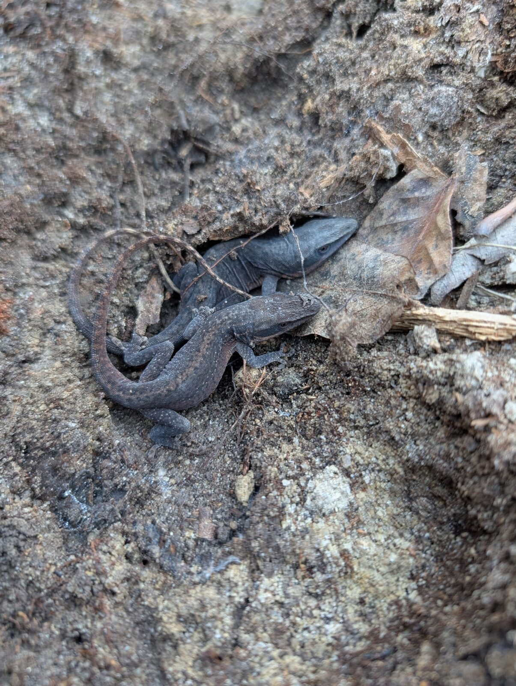

## Overview

![**Figure 1.** Accounting for the American green anole's (*Anolis carolinensis*) capacity to behaviorally exploit leaf-litter microclimates reconciles the apparent mismatch between its realized and fundamental cold-tolerance niche. (A) If we only consider estimates of lizard body temperatures (i.e., operative temperatures) in the above-ground canopy where anoles typically perch, the species' range limit (solid green line) inexplicably extends into areas where minimum annual body temperatures would fall below its critical thermal minimum (CT<sub>min</sub>; light blue) and even below freezing (dark blue). (B) However, accounting for behavioral thermoregulation resolves this paradox: mapping lizard body temperatures within the leaf litter shows that the species' poleward range edge aligns cleanly with areas where subsurface temperatures fall below zero. (D) At lower latitudes within the green anole's range (e.g., Miami), canopy temperatures rarely drop below CT<sub>min</sub>, allowing lizards to retain their ancestral behavior of sleeping in branches (E) without physiological stress. In contrast, at higher latitudes (e.g., Atlanta), canopy temperatures regularly drop below zero during winter, forcing lizards to retreat into the thermally buffered leaf litter (F) to avoid lethal cold. Notably, tree cover (C) also acts as a crucial spatial determinant of this distribution, providing both active-season structural habitat and the leaf litter needed for thermal winter refuge. Credit to Jon Suh (E) and Flown Kimmerling (F). The code used to plot panels A-D is in `raw_data/plot-figure-1.R`.](images/figure_1.jpg){fig-align="center"}

:::: {.columns}

::: {.column width="49%"}
```{=html}
<div id="carousel-canopy" class="carousel slide" data-bs-ride="carousel">
  <div class="carousel-inner">
    <div class="carousel-item active"></div>
    <div class="carousel-item"></div>
    <div class="carousel-item"></div>
  </div>
  <button class="carousel-control-prev" type="button" data-bs-target="#carousel-canopy" data-bs-slide="prev"><span class="carousel-control-prev-icon"></span></button>
  <button class="carousel-control-next" type="button" data-bs-target="#carousel-canopy" data-bs-slide="next"><span class="carousel-control-next-icon"></span></button>
</div>
```
<p class="text-center small">Sleeping in the canopy (photos: Jon Suh)</p>
:::

::: {.column width="2%"}
:::

::: {.column width="49%"}
```{=html}
<div id="carousel-litter" class="carousel slide" data-bs-ride="carousel">
  <div class="carousel-inner">
    <div class="carousel-item active"></div>
    <div class="carousel-item"></div>
    <div class="carousel-item"></div>
    <div class="carousel-item"></div>
    <div class="carousel-item"></div>
  </div>
  <button class="carousel-control-prev" type="button" data-bs-target="#carousel-litter" data-bs-slide="prev"><span class="carousel-control-prev-icon"></span></button>
  <button class="carousel-control-next" type="button" data-bs-target="#carousel-litter" data-bs-slide="next"><span class="carousel-control-next-icon"></span></button>
</div>
```
<p class="text-center small">In the leaf litter (photos from iNaturalist: <a href="https://www.inaturalist.org/observations/11361735">Flown Kimmerling</a>, <a href="https://www.inaturalist.org/observations/71590310">Sharon Watson</a>, <a href="https://www.inaturalist.org/observations/261977666">Grant Foster</a>)</p>
:::

::::

This website contains the supplementary code and data for our manuscript on how the American green anole (*Anolis carolinensis*) managed to expand its range from the tropics into temperate North America.

The green anole descends from a tropical Cuban clade of arboreal lizards and is the only one of the >400 species in the *Anolis* genus to have colonized temperate environments. Yet, its physiological cold tolerance (i.e., its critical thermal minimum, CT<sub>min</sub>) barely changes across its range, and most of its range regularly experiences temperatures below its CT<sub>min</sub>, and even below freezing. Here, we show that the green anole resolves this paradox through behavior rather than physiology. In winter, northern populations abandon their arboreal niche and retreat into the leaf litter of the forest floor, which buffers them from lethal cold. Accounting for this behavior, rather than above-ground temperatures alone, predicts the green anole's poleward range limit.

The analyses are organized into three vignettes that follow the structure of the results in the manuscript. In each vignette, code is folded by default (click on "Code" to expand a code chunk), and chunks that take a long time to run or require large raw files that are not included in this repository are not evaluated (`eval = FALSE`). For these, we save the output as an RDS file in the `data` folder, so every figure and table can be reproduced from the data included here.

## Vignettes and analysis

- [**Green anoles live beyond their physiological cold tolerance**](live-beyond-ctmin.qmd): We compare the critical thermal minimum (CT<sub>min</sub>) of green anoles across a latitudinal gradient with minimum annual temperatures and show that cold tolerance does not track climate. We then compare the green anole with 180 other lizard species and show that it is an exceptional case of a species living beyond its physiological cold tolerance limits (Fig. 2, S2, S3; Table S1-S4).

- [**Green anoles retreat to the leaf litter to avoid extreme cold**](leaf-litter-retreat.qmd): We combine standardized night surveys with operative temperature models (OTMs) to identify the temperature at which green anoles retreat from the canopy into the leaf litter (T<sub>ret</sub>), and quantify how much the leaf litter buffers the minimum temperatures lizards experience across latitudes (Fig. 3, S6; Table S5-S7).

- [**Leaf litter temperatures predict the green anole's poleward range limit**](leaf-litter-temps-range.qmd): We define the green anole's range using iNaturalist observations, use biophysical models to estimate the minimum annual body temperatures a green anole would experience in the canopy and at different depths in the leaf litter, and use mechanistic envelope models to test which microclimate best predicts the species' range (Fig. 4, S7, S8; Table S8).

## Datasets

The following datasets are used in this analysis and included in the `data` folder:

- `caro_inat_data.rds` - Raw iNaturalist occurrence data for the green anole (*Anolis carolinensis*).

- `caro_occ_data.rds` - Curated occurrence data for the green anole (*Anolis carolinensis*), with indicators for outlier locations.

- `caro_range.rds` - Polygon defining the native range of the green anole (*Anolis carolinensis*).

- `ctmin_gradient.rds` - Individual CT<sub>min</sub> estimates (°C) and body mass of 95 green anoles from 7 locations across the species' latitudinal range.

- `ctmin_lizards.rds` - CT<sub>min</sub>, elevational limits, substrate type (arboreal, semi-arboreal, other) and GARD range identifiers for 181 lizard species. Compiled from GlobTherm, SquamBase, Bodensteiner et al. (2024) and Salazar et al. (2025).

- `lizard_climatic_overfilling.rds` - Latitudinal limits, total range area, and the area and proportion of the range below CT<sub>min</sub> and below 0 °C for each of the 181 lizard species.

- `bio6_global.rds` - Global mean (± SD) minimum temperature of the coldest month (BIO6) for every degree of absolute latitude.

- `sleepy-lizard-survey-data.rds` - Night survey data from Atlanta, GA. Each row is either a lizard observation or, for surveys where no lizards were found, a placeholder row for the survey itself.

- `otms-data.rds` - Operative temperatures (°C) recorded by operative temperature models (OTMs) deployed in the canopy (`branch`) and leaf litter (`leaflitter`) at five locations: Miami (MIA), Port Saint Lucie (PSL), Orlando (ORL), Gainesville (GNV) and Atlanta (ATL).

- `eco_df.rds` - Forest cover, elevation, minimum and maximum temperature of the coldest month, and green anole presence for every 2.5' cell across southeastern North America.

- `micro_df.rds` - Output of the biophysical models: minimum annual ambient and operative (body) temperatures for every 2.5' cell and microclimate (i.e., height above or depth below the leaf-litter surface).

- `tss_grid.rds` - Output of the mechanistic envelope models: true skill statistic (TSS) for every combination of spatial extent, microclimate and forest cover threshold.

The raw data used to build these datasets (e.g., WorldClim and land cover rasters, GARD range maps, raw iButton files) are large and are not included in this repository. The scripts used to process them are stored in the `raw_data` folder alongside the raw files.
