```{r setup}
# run the code of the website vignettes to reuse their figures and tables
source("si-helpers.R")
library(tidyverse)
library(kableExtra)
library(ggpubr)
ctmin <- run_vignette("live-beyond-ctmin")
retreat <- run_vignette("leaf-litter-retreat")
biophys <- run_vignette("biophysical-models")
envelope <- run_vignette("envelope-models")
```

Guillermo Garcia-Costoya^1,\*^, Taylor L. Cooper^1^, Emma S. Glenn^1^, Jonathan J. Suh^1^, Matthew R. Anderson^1^, Miles D. Appleton^1^, Elle E. Garman^1^, Kathleen C. Griffin^1^, James T. Stroud^1,\*^

^1^School of Biological Sciences, Georgia Institute of Technology, Atlanta, GA, USA

\*Guillermo Garcia-Costoya, James T. Stroud. **Email:** ggarciacosto@gmail.com, stroud@gatech.edu

**This PDF file includes:**

::: {.si-includes}
Supporting text<br>
Figures S1 to S10<br>
Tables S1 to S11<br>
SI References
:::

All code and data used to produce these materials are available at https://github.com/ggcostoya/green-anole-litter, and every analysis can be explored at https://ggcostoya.github.io/green-anole-litter/.

::: {.si-section}
## Supporting Text
:::

### Biophysical models

Here we describe in detail how we estimated the minimum annual body (i.e., operative) temperatures that an American green anole (*Anolis carolinensis*) would experience in the canopy and at different depths in the leaf litter across southeastern North America, which we used in the mechanistic envelope models (Fig. S9). All models were implemented as vectorized functions in R, and the code is available at the project's GitHub repository and website.

### 1. Range of the green anole

We downloaded all research-grade iNaturalist observations of the green anole and curated them by (i) rounding coordinates to one decimal place, (ii) removing observations with a positional uncertainty greater than 1 km, (iii) keeping observations within the native range of the species (longitudes between 110° and 70°W and latitudes between 22.5° and 37.5°N), (iv) counting observations within each 0.1° × 0.1° cell and keeping only cells with at least three observations, to eliminate isolated observations caused by potential errors or rare occurrences, and (v) removing cells with fewer than three other occupied cells within 50 km. We then manually drew a polygon around the curated cells to define the range of the species (Fig. S10), and assumed that the green anole is present in all cells within this polygon and absent from all cells outside of it.

### 2. Environmental data

For every 2.5′ latitude-longitude cell within a study area extending 2° beyond the range polygon in all directions, and restricted to land areas of the continental United States and Mexico, we obtained:

- **Forest cover** ($C$, from 0 to 1): the proportion of each cell covered by trees, mangroves or wetlands in the ESA WorldCover dataset (accessed through the `landcover` function of the R package `geodata`), aggregated from its original 30″ resolution to 2.5′.
- **Elevation** ($Elev$, in m) from WorldClim 2.1 (Fick & Hijmans 2017).
- **Minimum and maximum air temperatures** ($T_{min}$ and $T_{max}$, in °C) of January, the coldest month of the year, from WorldClim 2.1.

### 3. Microclimate models

For each cell, we generated hourly profiles of solar radiation and temperature on a representative day of the coldest month of the year (15 January, day of the year $DOY = 15$), and used them to estimate temperatures at 23 heights and depths: 1.8 and 2 m above the ground (the canopy), the ground surface, and leaf-litter depths from 1 to 20 cm at 1-cm intervals. All model parameters are listed in Table S11.

#### 3.1. Solar radiation

We estimated hourly direct solar radiation ($R_{solar}$) as a function of location, day of the year and elevation. We first estimated the ecliptic longitude of the sun ($\lambda$) as a function of the day of the year and the eccentricity of the Earth's orbit ($e$):

$$
\lambda = \frac{2\pi}{365}(DOY - 80) + 2e\left[\sin\left(\frac{2\pi}{365}DOY\right) - \sin\left(\frac{2\pi}{365}80\right)\right]
$$

where day 80 approximates the vernal equinox. From this, we calculated the solar declination angle ($\delta$):

$$
\delta = \arcsin(0.3879672 \cdot \sin\lambda)
$$

where $\arcsin(0.3879672) = 22.82°$ approximates the Earth's average axial tilt over a year. The sine of the solar altitude angle at hour $h$ ($a(h)$) was then calculated from latitude ($lat$) and the time of solar noon ($S_n$, obtained with the `solar_noon` function of the R package `TrenchR`; Buckley et al. 2023):

$$
a(h) = \sin(lat)\sin(\delta) + \cos(lat)\cos(\delta)\cos\left[0.2618\,(h - S_n)\right]
$$

where $0.2618$ rad h^−1^ is the Earth's rotational speed (15° h^−1^). To account for the effect of elevation on the atmospheric absorption of solar radiation, we modeled barometric pressure ($p_a$, in kPa) as:

$$
p_a = 101.3\, e^{-Elev/8200}
$$

and calculated the atmospheric path length ($m_a$) as:

$$
m_a(h) = \frac{p_a}{101.3\, a(h)}
$$

Finally, hourly direct solar radiation (in W m^−2^) was calculated from the extraterrestrial solar constant ($E_{sc}$) and the atmospheric transmittance coefficient ($\tau$), and set to zero when the sun is below the horizon:

$$
R_{solar}(h) = 1000 \cdot E_{sc}\, \tau^{m_a(h)}\, a(h)
$$

#### 3.2. Air temperature

We estimated hourly air temperature ($T_{air}$) by interpolating between the daily minimum and maximum air temperatures with a sinusoidal weighting function (Campbell & Norman 1998). With the angular frequency of the daily temperature cycle $\omega = \pi/12$ rad h^−1^, the weight of the maximum temperature at hour $h$ is:

$$
\gamma(h) = 0.44 - 0.46\sin(0.9 + \omega h) + 0.11\sin(0.9 + 2\omega h)
$$

and hourly air temperature is:

$$
T_{air}(h) = T_{max}\,\gamma(h) + T_{min}\,[1 - \gamma(h)]
$$

#### 3.3. Effect of forest cover on air temperature

Forest canopies intercept part of the incoming solar radiation, cooling the air below them during the day. We modeled this effect as proportional to both solar radiation and forest cover, using a canopy cooling coefficient ($b_c$):

$$
T'_{air}(h) = T_{air}(h) - b_c\, R_{solar}(h)\, C
$$

Under peak solar radiation (800–1000 W m^−2^) and a fully closed canopy, this coefficient yields a maximum daytime cooling of 5.6–7 °C, consistent with measurements from understory microclimate logger networks in temperate and subtropical forests (De Frenne et al. 2013, 2019; Zellweger et al. 2020).

#### 3.4. Surface temperature

Exposed ground surfaces heat up above air temperature during the day. We modeled this effect as proportional to solar radiation and to the proportion of the ground not covered by forest, using a surface heating coefficient ($b_s$):

$$
T_{surf}(h) = T'_{air}(h) + b_s\, R_{solar}(h)\, (1 - C)
$$

Under peak unshaded solar radiation, this coefficient yields a daytime surface temperature 16–20 °C above air temperature, consistent with standard microclimate energy balance formulations (Campbell & Norman 1998) and measurements of forest floor microclimates (De Frenne et al. 2019; Maclean et al. 2019).

#### 3.5. Temperatures above the surface

Above the surface, we assumed a logarithmic transition between surface temperature and the forest-corrected air temperature at the reference height of the climate data ($z_{ref} = 1.8$ m). The relative influence of air temperature at height $z$ was described by:

$$
\phi(z) = \frac{\ln\left[(z + z_0)/z_0\right]}{\ln\left[(z_{ref} + z_0)/z_0\right]}
$$

where $z_0$ is a small roughness length that avoids the singularity of the logarithm at the surface. Temperature at height $z$ was then:

$$
T(z, h) = T_{surf}(h) - \left[T_{surf}(h) - T'_{air}(h)\right]\phi(z)
$$

#### 3.6. Temperatures in the leaf litter

Below the surface, we modeled the propagation of the daily temperature cycle into the leaf litter using the analytical solution of the one-dimensional heat conduction equation (Campbell & Norman 1998). The thermal diffusivity of the leaf litter ($\kappa$) was calculated from its thermal conductivity ($k$), bulk density ($\rho$) and specific heat capacity ($c_p$):

$$
\kappa = \frac{k}{\rho\, c_p}
$$

We used values representative of dry, loosely packed organic leaf litter rather than mineral soil, since the high porosity of litter (80–90%) traps insulating pockets of still air that give it a much lower thermal conductivity and bulk density than mineral soil (Table S11). From the diffusivity and the angular frequency of the daily cycle ($\omega = 2\pi/24$ rad h^−1^), we calculated the damping depth ($D$), at which the amplitude of the surface temperature cycle is reduced by a factor of $e$:

$$
D = \sqrt{2\kappa/\omega}
$$

At depth $z$, temperature fluctuations are reduced in amplitude by a factor $A(z)$ and delayed by $\Delta t(z)$ hours relative to the surface:

$$
A(z) = e^{-|z|/D} \qquad \Delta t(z) = \frac{|z|}{D}\cdot\frac{24}{2\pi}
$$

Temperature at depth $z$ was then calculated by damping the delayed surface temperature (obtained by linear interpolation of the hourly surface temperature profile, treating it as a repeating daily cycle) around the mean daily surface temperature ($\bar{T}_{surf}$):

$$
T(z, h) = \bar{T}_{surf} + \left[T_{surf}(h - \Delta t(z)) - \bar{T}_{surf}\right] A(z)
$$

For each cell and microclimate, we retained the minimum hourly temperature of the day as the minimum annual temperature of that microclimate.

### 4. Operative temperatures

We transformed minimum annual microclimate temperatures into the minimum operative temperatures ($T_e$) of a green anole, i.e., the steady-state body temperature a lizard reaches in thermal equilibrium with its environment. Because the coldest temperatures of the day occur at night, we assumed that there was no solar radiation.

**Within the leaf litter**, a lizard is fully surrounded by litter at ambient temperature and has no view of the night sky, so we assumed that its operative temperature equals the temperature of the litter at that depth, $T_e = T(z)$.

**Above the ground**, we calculated operative temperature as the conductance-weighted average of the minimum air temperature in that microclimate ($T(z)$), ground temperature ($T_{ground}$, assumed equal to air temperature) and an equivalent radiant temperature ($T_{rad}$):

$$
T_e = \frac{h_c\, T(z) + h_k\, T_{ground} + h_r\, T_{rad}}{h_c + h_k + h_r}
$$

where $h_c$, $h_k$ and $h_r$ are the convective, conductive and radiative heat transfer coefficients (W m^−2^ K^−1^). We scaled body mass ($m$, in kg; 3.1 g, the typical mass of a green anole) to a characteristic length ($L$, in m) assuming standard reptile allometry, $L = 0.02\, m^{1/3}$, and calculated the convective heat transfer coefficient as the larger of forced convection (driven by wind speed, $u$) and free convection:

$$
h_c = \max\left(\frac{10.3\, u^{0.6}}{L^{0.4}},\ 3.5\, L^{-0.25}\right)
$$

We set wind speed to 0.1 m s^−1^, representing the near-still air typical of sheltered forest understories at night, which minimizes convective heat exchange and thereby amplifies the relative effect of radiative cooling. Conduction to the perch was represented by a fixed coefficient ($h_k$) representing a small lizard resting against a solid substrate. Radiative heat transfer was linearized around air temperature (in K) using the Stefan-Boltzmann constant ($\sigma$) and the emissivity of lizard skin ($\epsilon_{lizard}$):

$$
h_r = 4\,\epsilon_{lizard}\,\sigma\,T_{air,K}^3
$$

The equivalent radiant temperature combines thermal radiation from the night sky and from the ground, weighted by their view factors ($F_{sky}$ and $F_{ground}$; 0.5 each for a lizard sleeping horizontally on a perch):

$$
T_{sky,K} = \epsilon_{sky}^{0.25}\, T_{air,K} \qquad T_{rad,K} = \left(F_{sky}\, T_{sky,K}^4 + F_{ground}\, T_{ground,K}^4\right)^{0.25}
$$

where the emissivity of a clear night sky ($\epsilon_{sky}$) makes its effective temperature substantially lower than air temperature. These assumptions are simplifications of real-world conditions, but they provide a conservative (i.e., cold) estimate of the operative temperature of a small lizard sleeping in the canopy on a clear, calm winter night.

### 5. Validation

We validated the biophysical models by comparing the predicted minimum operative temperatures in the canopy (1.8 m) and in the leaf litter (8 cm, the midpoint of the 5–10 cm depths at which litter OTMs were deployed) of the cells within 0.1° of each of the five locations where we deployed operative temperature models (OTMs) with the mean daily minimum temperatures recorded by each OTM between 11 and 19 January, a window centered on the representative day used in the models. Predictions closely matched observations in both microhabitats (Fig. S8; Table S10).

::: {.si-section}
## Supplementary Figures
:::

::: {.si-item .si-first}

**Figure S1.** Sightings of American green anoles (*Anolis carolinensis*) in leaf litter and other ground-level refuges reported by iNaturalist users.

::: {.photo-row}
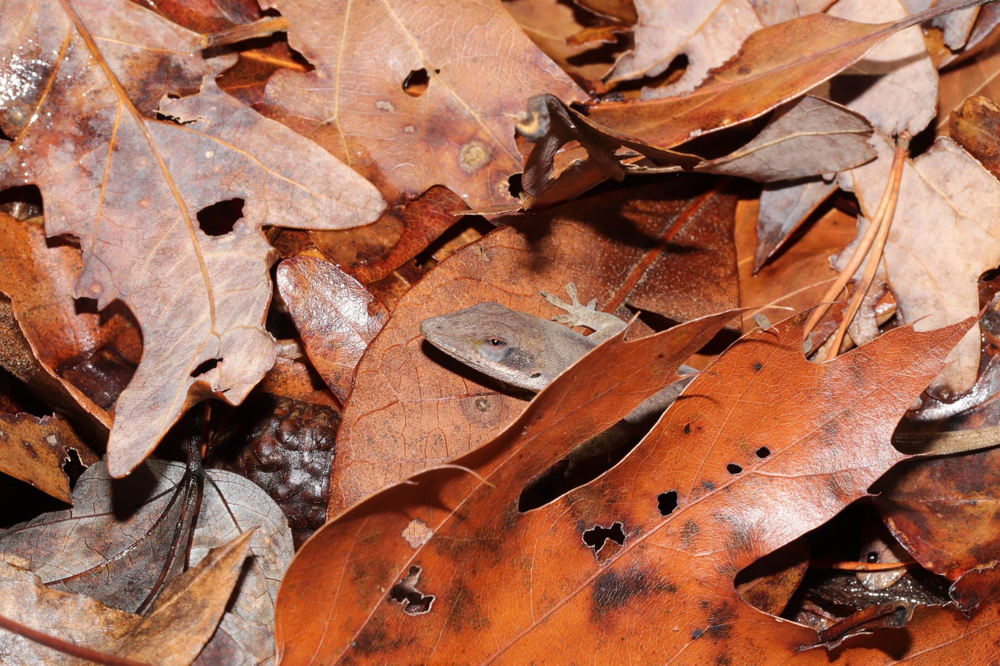
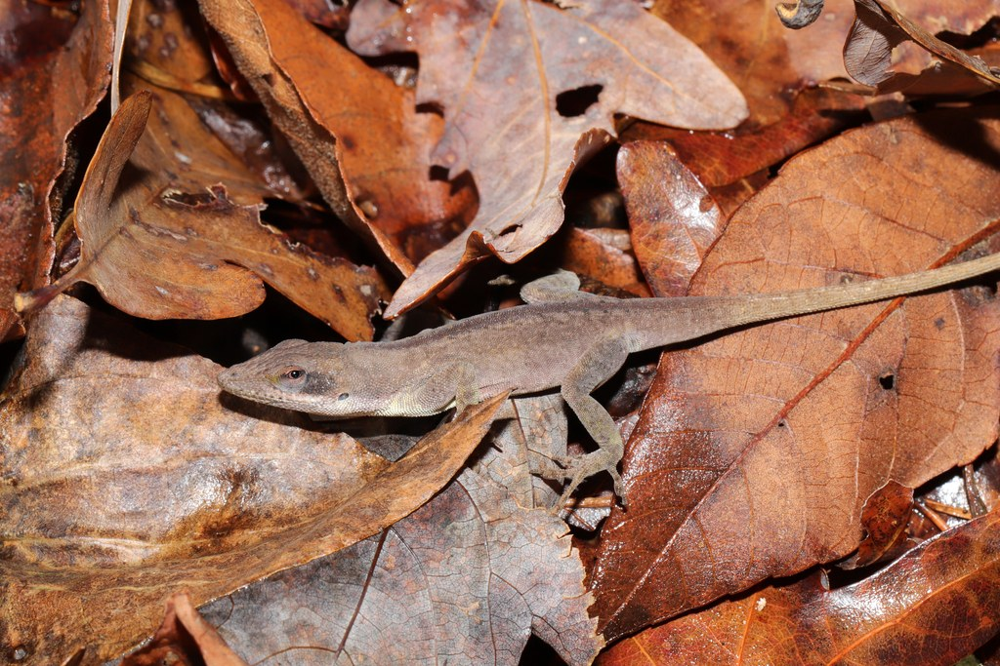
:::

::: {.photo-credit}
Oakman, Georgia, USA, late November 2020. Credit to Flown Kimmerling (https://www.inaturalist.org/observations/11361735): "In deep leaf litter in a mixed forest understory."
:::

::: {.photo-row}
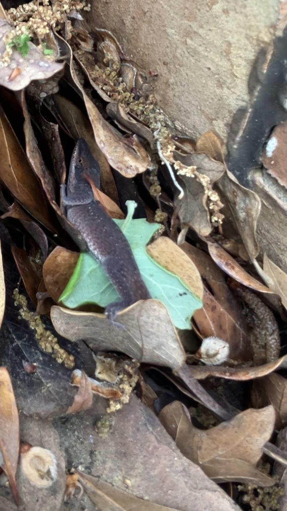
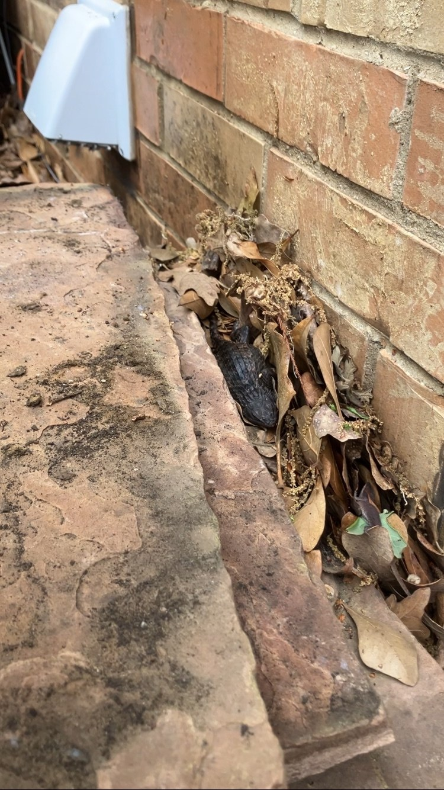
:::

::: {.photo-credit}
Lewisville, Texas, USA, during a cold snap in April 2025. A green anole (zoomed in on the left) was found next to a Texas spiny lizard (*Sceloporus olivaceus*; right). Credit to Daric Rodgers (https://www.inaturalist.org/observations/269032085): "A Green Anole and a Texas Spiny Lizard found side-by-side attempting to survive an April cold snap that got down into the 30s [~ -1 °C]. I removed a landscaping paver that provided a roof over some compacted leaf litter that was wedged against the wall right beside my exterior dryer vent."
:::

::: {.photo-row}
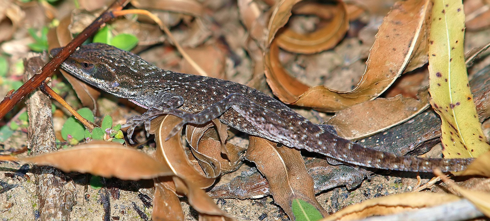
:::

::: {.photo-row}
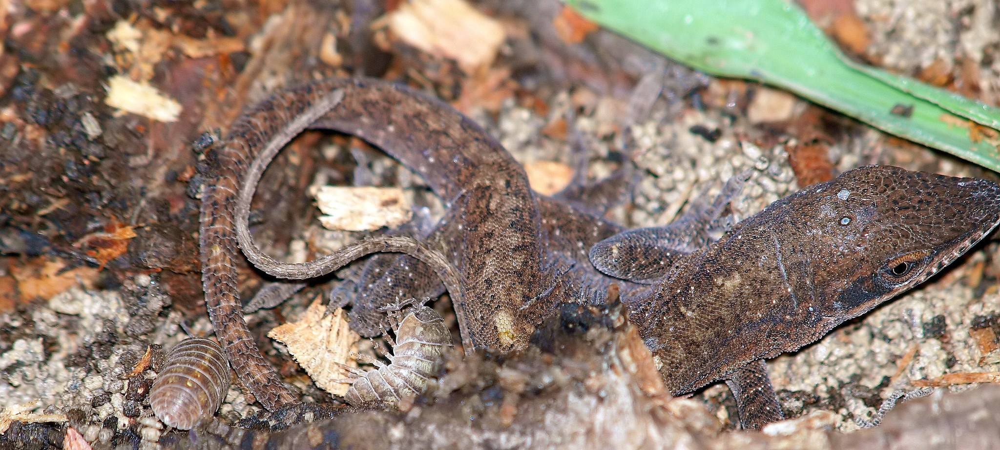
:::

::: {.photo-credit}
Garland, Texas, USA, November 2019. Credit to Kala King (top: https://www.inaturalist.org/observations/100186678; bottom: https://www.inaturalist.org/observations/99989775): (top) "I found this cold anole by carefully scuffing through the leaf litter. It crawled out from under a pile of leaves. And kept slowly crawling until it disappeared under another pile of leaves." (bottom) "Under a small log I found an anole asleep. In cold weather they stay under leaves and wood, don't eat and don't move very much."
:::

::: {.photo-row}
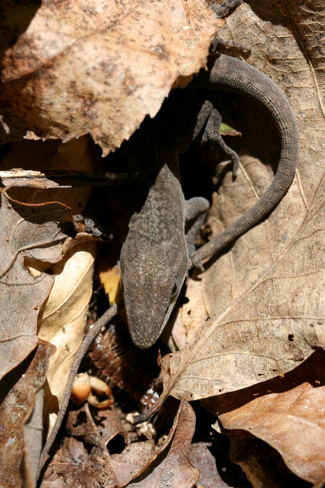
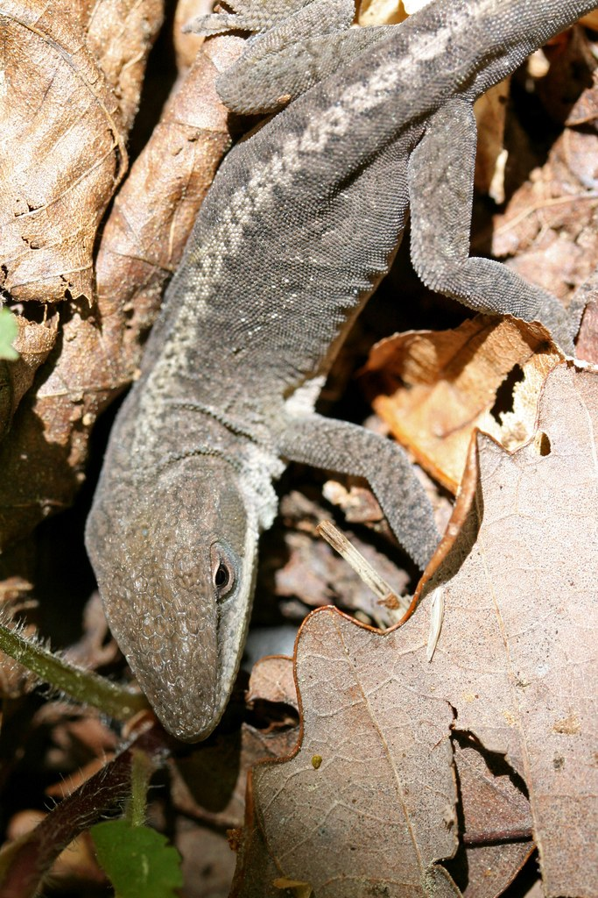
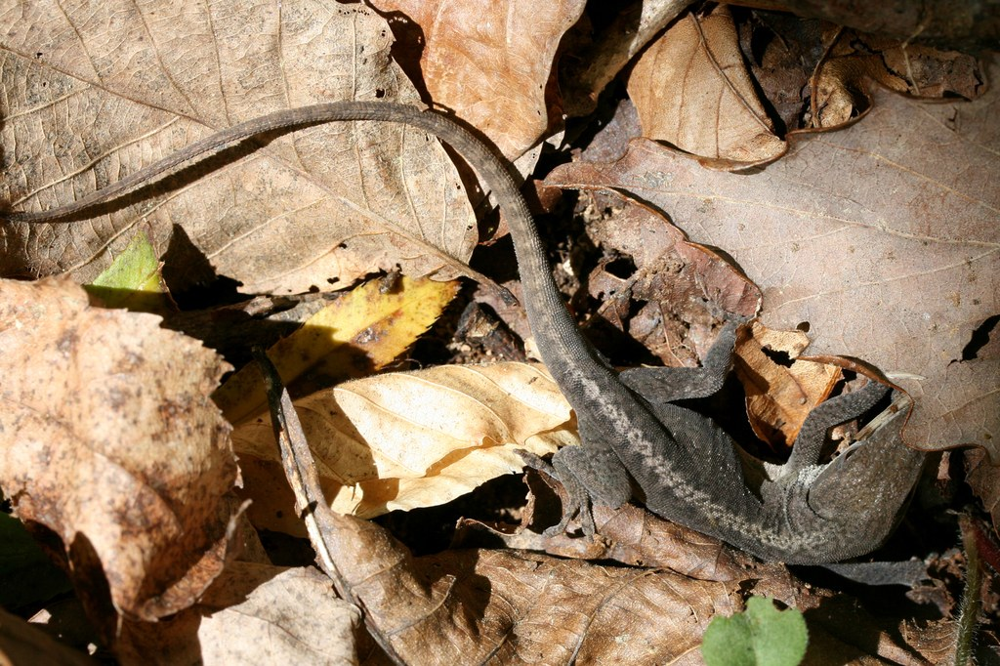
:::

::: {.photo-credit}
Oakman, Georgia, USA, April 2018. Credit to Flown Kimmerling (https://www.inaturalist.org/observations/11361735): "Under deep leaf litter on the side of a ridge near a seasonal stream in a dense mixed hardwood/coniferous forest in NW Georgia (Gordon County), US."
:::

::: {.photo-row}
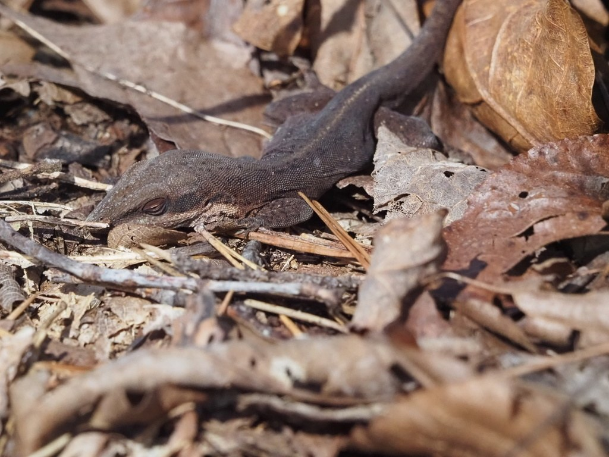
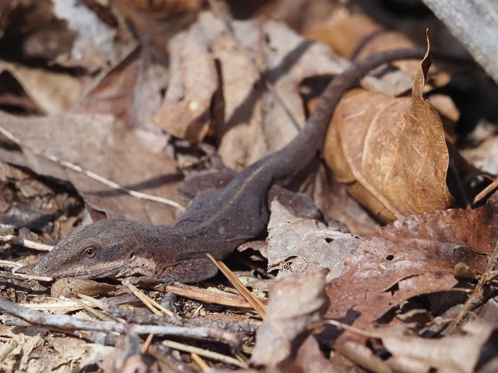
:::

::: {.photo-credit}
Spartanburg, South Carolina, USA, March 2021. Credit to Sharon Watson (https://www.inaturalist.org/observations/71590310): "Lethargic. Cold?"
:::

::: {.photo-row}
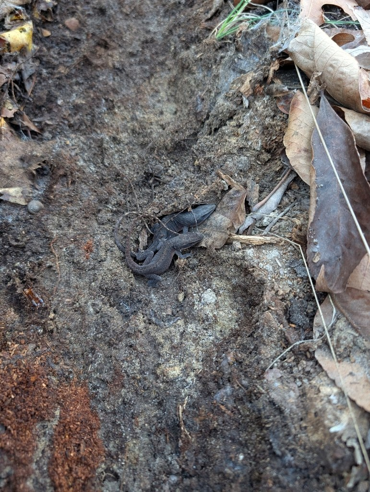
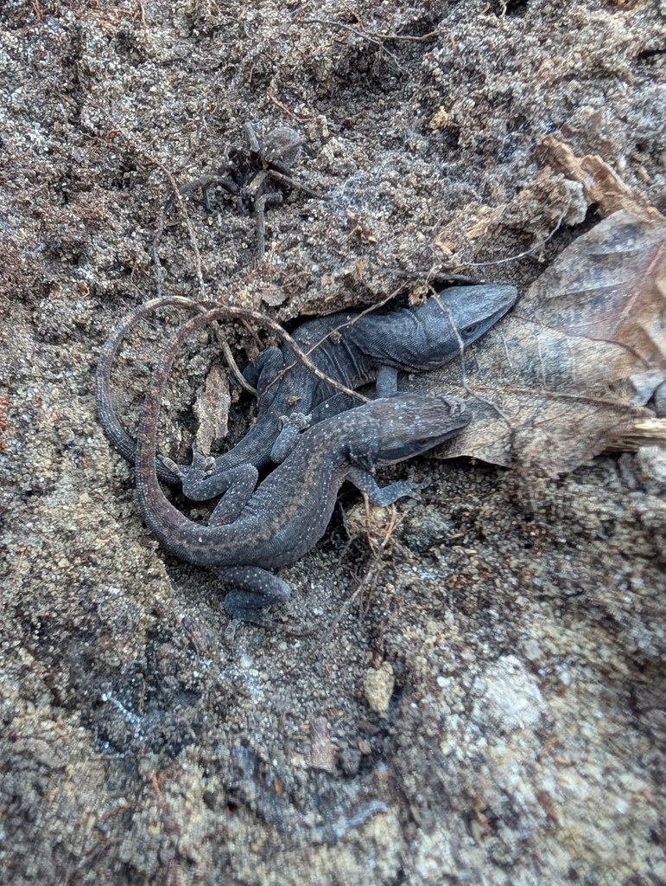
:::

::: {.photo-credit}
Columbia, South Carolina, USA, February 2025. Credit to Grant Foster (https://www.inaturalist.org/observations/261977666): "Found hanging out underneath a rotting log, hiding from the cold."
:::

:::

::: {.si-item}

```{r figure-s2}
#| fig-width: 5
#| fig-height: 5
#| out-width: "60%"
#| fig-align: center
ctmin$fig_ctmin_bio6
```

::: {.si-legend}
**Figure S2.** Latitudinal variation in the minimum temperature of the coldest month (BIO6, shown as Min. Temp.; blue) and the critical thermal minimum (CT~min~; green) of American green anoles (*Anolis carolinensis*). For BIO6, the solid line and shaded area show the mean and range (minimum to maximum) of values within each 0.1° latitude band of a bounding box defined by the locations where we measured CT~min~ (extended by 1° to the east, west and south, and 0.5° to the north). For CT~min~, points show individual estimates (n = `{r} nrow(ctmin$ctmin_gradient)` lizards from `{r} n_distinct(ctmin$ctmin_gradient$site)` populations; jittered horizontally for visibility), and the solid line and shaded area show the predicted latitudinal trend and its 95% confidence interval from a linear mixed model with population as a random effect (Table S2). The dashed line marks 0 °C.
:::

:::

::: {.si-item}

```{r figure-s3}
#| fig-width: 9
#| fig-height: 5
#| out-width: "100%"
ctmin$fig_substrate
```

::: {.si-legend}
**Figure S3.** The American green anole (*Anolis carolinensis*) is an exceptional case of mismatch between realized and fundamental cold thermal limits among arboreal lizards. (A) The latitudinal range of each of the `{r} nrow(ctmin$lizard_climatic_overfilling)` lizard species in our dataset, placed at the height of its critical thermal minimum (CT~min~) and colored by substrate use (exclusively arboreal, semi-arboreal or other), compared with the global mean (± SD) minimum temperature of the coldest month (BIO6; blue line and area) at each latitude. The range of the green anole (dark green) extends into latitudes where BIO6 is well below its CT~min~ (6.8 °C, the lowest population-average CT~min~ across its range). (B, C) Proportion (B) and area (C, log scale) of each species' range below its CT~min~ and below 0 °C. Points with error bars show the mean (± SE) of each substrate group, and the large dark green point the green anole. Only a few other exclusively arboreal species have ranges that extend below their CT~min~ (four *Chamaeleo* and four *Anolis* species), and only two below 0 °C (*Chamaeleo hoehnelii* and *C. schubotzi*); in all cases, the area affected is orders of magnitude smaller than for the green anole. Substrate use follows SquamBase, except for *Liolaemus tenuis*, which we classified as semi-arboreal because it adopts a saxicolous/terrestrial strategy in many parts of its range.
:::

:::

::: {.si-item}

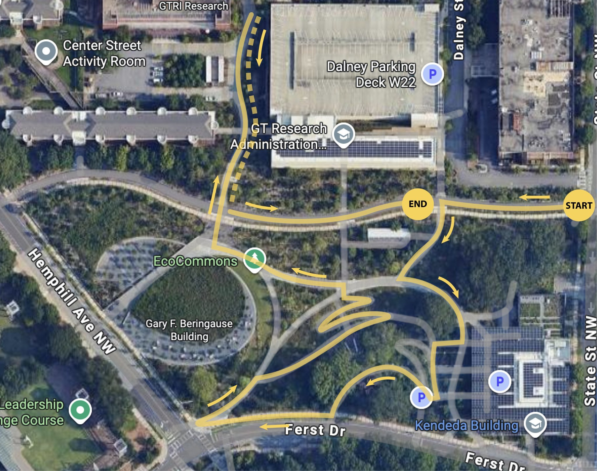{width="62%" fig-align="center"}

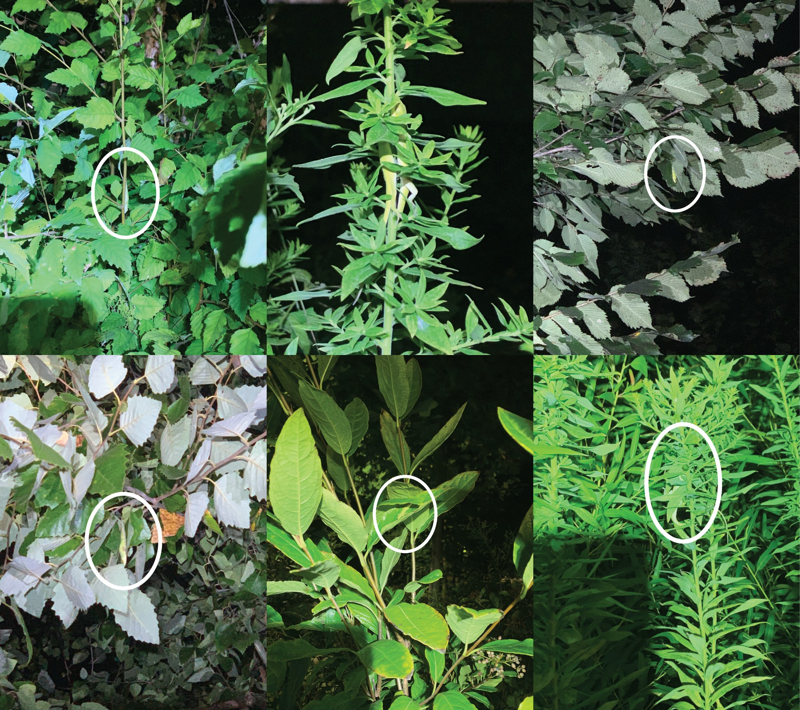{width="62%" fig-align="center"}

::: {.si-legend}
**Figure S4.** Night survey transect on the Georgia Institute of Technology campus in Atlanta, Georgia, USA (top), and photographs of American green anoles (*Anolis carolinensis*) observed sleeping in vegetation during our surveys (bottom).
:::

:::

::: {.si-item}

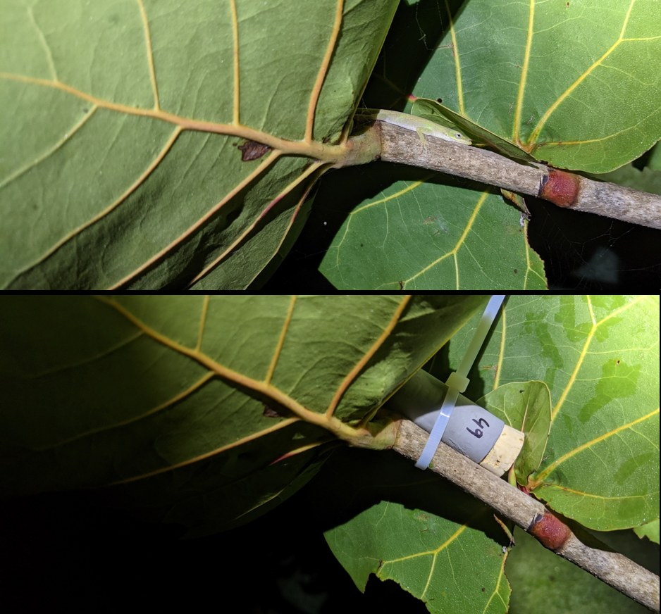{width="65%" fig-align="center"}

::: {.si-legend}
**Figure S5.** Comparison between a perching American green anole (*Anolis carolinensis*; top) and an operative temperature model (OTM; bottom).
:::

:::

::: {.si-item}

```{r figure-s6}
#| fig-width: 8
#| fig-height: 7
#| out-width: "100%"
retreat$fig_survey
```

::: {.si-legend}
**Figure S6.** Presence (A) and number (B) of American green anoles (*Anolis carolinensis*) observed during our `{r} nrow(retreat$survey_sum)` night surveys between September 2025 and April 2026 in Atlanta, Georgia, USA (black points). Green and orange lines show the average operative temperature recorded by operative temperature models (OTMs) deployed in the canopy and in the leaf litter, respectively, between 1 and 2 hours after sunset on each day. The steel blue dashed line marks CT~min~ (6.8 °C, the lowest population-average CT~min~ across the species' range) and the dark blue dashed line 0 °C. Lizards disappeared from the vegetation as temperatures dropped in fall and winter, and reappeared on warm nights in winter and spring.
:::

:::

::: {.si-item}

```{r figure-s7}
#| fig-width: 10
#| fig-height: 5
#| out-width: "100%"
ggarrange(
  retreat$photoperiod_plot,
  retreat$interaction_plot,
  ncol = 2,
  labels = c("A", "B"),
  font.label = list(size = 16, face = "bold")
)
```

::: {.si-legend}
**Figure S7.** Photoperiod does not explain the decline in the probability of observing American green anoles (*Anolis carolinensis*) during our night surveys. (A) Predicted observation probability as a function of photoperiod at the average canopy operative temperature across surveys (`{r} sprintf("%.1f", retreat$mean_survey_temp)` °C). Points show the presence or absence of lizards in each survey, shaded by photoperiod (darker for shorter days). (B) Predicted observation probability as a function of canopy operative temperature at the shortest (`{r} sprintf("%.1f", min(retreat$survey_sum_model$photoperiod))` h), average (`{r} sprintf("%.1f", retreat$mean_photoperiod)` h) and longest (`{r} sprintf("%.1f", max(retreat$survey_sum_model$photoperiod))` h) photoperiods of our surveys. Lines show the predictions of a Bernoulli generalized linear model including canopy temperature, photoperiod and their interaction (Table S5), and shaded areas the 95% confidence intervals of the predictions (in B, at the average photoperiod only).
:::

:::

::: {.si-item}

```{r figure-s8}
#| fig-width: 5
#| fig-height: 5
#| out-width: "60%"
#| fig-align: center
biophys$fig_validation
```

```{r figure-s8-metrics}
val <- biophys$validation_metrics
val_canopy <- val[val$microhabitat == "Canopy", ]
val_litter <- val[val$microhabitat == "Leaf Litter", ]
```

::: {.si-legend}
**Figure S8.** Validation of the minimum operative temperatures estimated by our biophysical models against those recorded by operative temperature models (OTMs) at five locations across the latitudinal range of the American green anole (*Anolis carolinensis*). Each point shows the mean daily minimum temperature recorded by one OTM between 11 and 19 January (observation) against the minimum operative temperature predicted for its location and microhabitat (prediction; canopy at 1.8 m and leaf litter at 8 cm, the midpoint of the depths at which litter OTMs were deployed). Point colors indicate the microhabitat, and solid lines and shaded areas the best-fit line and standard error of a linear model for each microhabitat. The dashed black line indicates the 1:1 relationship. Predictions closely matched observations in the canopy (bias = `{r} sprintf("%.2f", val_canopy$bias)` °C; RMSE = `{r} sprintf("%.2f", val_canopy$rmse)` °C; n = `{r} val_canopy$n_otms` OTMs) and in the leaf litter (bias = `{r} sprintf("%.2f", val_litter$bias)` °C; RMSE = `{r} sprintf("%.2f", val_litter$rmse)` °C; n = `{r} val_litter$n_otms` OTMs; Table S10).
:::

:::

::: {.si-item}

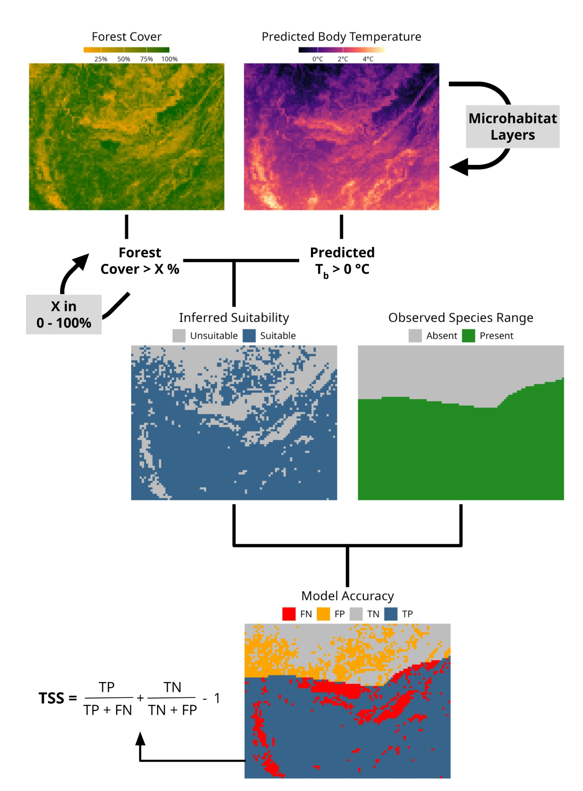{width="58%" fig-align="center"}

::: {.si-legend}
**Figure S9.** Diagram of our mechanistic envelope modeling approach. We start by obtaining spatially explicit data on a set of ecological variables of interest, in our case forest cover and environmental temperature, and use both layers to derive new layers of predicted lizard body temperatures across a range of microhabitats using biophysical models (Supporting Text). We then select a given microhabitat layer and set a percentage of forest cover as a threshold. Combining these two layers, we create an inferred suitability layer, assigning as suitable all spatial cells where forest cover is greater than the selected threshold and where the predicted minimum annual body temperature of the lizard (T~b~) is greater than 0 °C. Next, we compare the inferred suitability layer with the observed species range cell by cell, classifying each cell as a false negative (FN; red) if we infer it unsuitable but it falls within the species range, a false positive (FP; orange) if we infer it suitable but it falls outside the range, a true negative (TN; gray) if we infer it unsuitable and it falls outside the range, or a true positive (TP; blue) if we infer it suitable and it falls within the range. Lastly, we calculate the true skill statistic (TSS) of each combination of microhabitat and forest cover threshold. We repeat this process for every microhabitat layer and every forest cover threshold (0 to 100% at 5% intervals) within a given area, and identify the combination that maximizes TSS.
:::

:::

::: {.si-item}

```{r figure-s10}
#| fig-width: 6
#| fig-height: 5
#| out-width: "80%"
#| fig-align: center
biophys$fig_range
```

::: {.si-legend}
**Figure S10.** Range of the American green anole (*Anolis carolinensis*) used in our analyses. We used 0.1° latitude-longitude cells with at least three accurately georeferenced (positional uncertainty < 1 km) iNaturalist observations of the species (dark green points) within southeastern North America to define a polygon bounding the green anole's range (light green area). Cells with fewer than three other occupied cells within 50 km were considered outliers (red points) and were not considered when drawing the polygon.
:::

:::

::: {.si-section}
## Supplementary Tables
:::

::: {.si-item .si-first}

::: {.si-caption}
**Table S1.** Critical thermal minimum (CT~min~) of American green anoles (*Anolis carolinensis*) and minimum temperature of the coldest month (BIO6) by location and latitude. CT~min~ values are the mean and standard deviation (SD) across individuals at each location. BIO6 values are the mean, minimum and maximum within the 0.1° latitude band containing each location, across a bounding box defined by all sampling locations (extended by 1° to the east, west and south, and 0.5° to the north).
:::

```{r table-s1}
#| results: asis
print_tables(ctmin$table_ctmin_sites)
```

:::

::: {.si-item}

::: {.si-caption}
**Table S2.** Results of a linear mixed model examining how the CT~min~ of American green anoles (*Anolis carolinensis*) and the minimum temperature of the coldest month (BIO6) change with latitude. The intercept represents BIO6 at a latitude of zero, and C is an indicator variable for the temperature type (C = 0 for BIO6 and C = 1 for CT~min~). The model includes a random intercept for population that applies only to CT~min~ observations, and a separate residual variance for each temperature type, and was fitted by restricted maximum likelihood (REML) with the R package `nlme`. Denominator degrees of freedom (df) for terms involving CT~min~ are based on the number of populations. The latitudinal slopes of each temperature type come from the same model, reparameterized with a separate intercept and slope for each type.
:::

```{r table-s2}
#| results: asis
print_tables(
  ctmin$table_params, ctmin$table_slopes, ctmin$table_variance, ctmin$table_info
)
```

:::

::: {.si-item}

::: {.si-caption}
**Table S3.** Proportion (Prop.) and area of the range of `{r} nrow(ctmin$lizard_climatic_overfilling)` lizard species that falls below their CT~min~ and below 0 °C (based on the minimum temperature of the coldest month, BIO6), together with their CT~min~ and substrate use. All areas are expressed in millions of km^2^. Proportions could not be calculated for two species whose ranges contain no climate grid cells within their elevational limits. The American green anole (*Anolis carolinensis*) is highlighted.
:::

```{r table-s3}
#| results: asis
print_tables(ctmin$table_species)
```

:::

::: {.si-item}

::: {.si-caption}
**Table S4.** Outlier analysis comparing the cold-climate mismatch of the American green anole (*Anolis carolinensis*) with that of other lizards. For each metric, we calculated the Z-score of *A. carolinensis* relative to three comparison groups: *Anolis* species (n = `{r} sum(ctmin$lizard_climatic_overfilling$genus == "Anolis")`), exclusively arboreal lizards (n = `{r} sum(ctmin$lizard_climatic_overfilling$substrate %in% "arboreal")`) and all lizards in our dataset (n = `{r} nrow(ctmin$lizard_climatic_overfilling)`). The Z-score is the number of standard deviations by which *A. carolinensis* lies above (positive values) or below (negative values) the group mean. "Below CT~min~" and "below 0 °C" refer to areas where the minimum temperature of the coldest month (BIO6) falls below each species' critical thermal minimum (6.8 °C for *A. carolinensis*, the lowest population-average CT~min~ across its range) or below freezing. Because areas span several orders of magnitude, their Z-scores were calculated on log~10~(area + 1 km^2^). Because many species have no area below a threshold, we also report the rank of *A. carolinensis* within each group (1 = largest value; ties share the highest rank), as rank / number of species with data. Proportions could not be calculated for *A. placidus* and *Phymaturus dorsimaculatus*. *Anolis carolinensis* is included in all three groups, and it is the only *Anolis* whose range extends below 0 °C, so its Z-scores for these metrics relative to *Anolis* reflect a single non-zero value.
:::

```{r table-s4}
#| results: asis
print_tables(ctmin$table_z_scores)
```

:::

::: {.si-item}

::: {.si-caption}
**Table S5.** Results of a generalized linear model with a Bernoulli error structure (logit link) examining how the probability of detecting American green anoles (*Anolis carolinensis*) during night surveys changed with the average canopy operative temperature during the survey period (1–2 h after sunset; T), photoperiod (D; hours between sunrise and sunset in Atlanta on the day of the survey) and their interaction. Temperature and photoperiod were centered on their means across surveys, so the intercept (α) and the temperature effect (β~T~) apply at an average photoperiod, and the photoperiod effect (β~D~) at an average temperature. The *z* statistic tests whether each coefficient differs from zero (Wald test). Likelihood-ratio tests (LRT) compare the full model with a model without the interaction (1 df) or without a predictor and its interaction (2 df). Tjur's R^2^ is the difference between the mean predicted probability of detection for surveys with and without lizards. Temperature thresholds are the canopy temperatures at which the predicted observation probability equals each value at the average photoperiod, with 95% confidence intervals obtained with the delta method. The behavioral retreating temperature (T~ret~) is defined as the temperature at which observation probability falls to 0.20.
:::

```{r table-s5}
#| results: asis
print_tables(retreat$table_params, retreat$table_fit, retreat$table_thresholds)
```

:::

::: {.si-item}

::: {.si-caption}
**Table S6.** Average (± SD across operative temperature models, OTMs) and absolute minimum nightly operative temperatures recorded by OTMs in the canopy and in the leaf litter at each location during January 2026, the coldest month of the year. "Buffer" is the difference between the average minimum temperatures in the leaf litter and in the canopy. We recorded temperatures with `{r} n_distinct(paste(retreat$otms_data_sum$location, retreat$otms_data_sum$id)[retreat$otms_data_sum$microhabitat == "branch"])` canopy and `{r} n_distinct(paste(retreat$otms_data_sum$location, retreat$otms_data_sum$id)[retreat$otms_data_sum$microhabitat == "leaflitter"])` leaf-litter OTMs across the five locations, after excluding two leaf-litter OTMs in Atlanta that became exposed during deployment.
:::

```{r table-s6}
#| results: asis
print_tables(retreat$table_location_summary)
```

:::

::: {.si-item}

::: {.si-caption}
**Table S7.** Results of a linear mixed model examining how nightly minimum operative temperatures recorded by operative temperature models (OTMs) in January changed with latitude and microhabitat (canopy vs. leaf litter). M is an indicator variable for microhabitat (M = 0 for canopy, M = 1 for leaf litter). Latitude (L) was centered on the mean latitude of the five locations (`{r} sprintf("%.1f", retreat$mean_lat)`°N), so α is the canopy minimum temperature at that latitude, and β~M~ is the average buffering provided by the leaf litter (leaf-litter minus canopy minimum temperature) at that latitude. The model includes random intercepts for each OTM, location and night within location. Each fixed effect is tested against zero with a t-test whose standard error and denominator degrees of freedom (df) use the Kenward–Roger approximation; df vary among terms because latitude varies only among the five locations, whereas microhabitat varies among OTMs within locations. The latitudinal slopes give the rate at which minimum temperatures decline per degree of latitude in each microhabitat (β~L~ for the canopy and β~L~ + β~L·M~ for the leaf litter). Two leaf-litter OTMs in Atlanta that became exposed during deployment were excluded.
:::

```{r table-s7}
#| results: asis
print_tables(
  retreat$table_buffer_params, retreat$table_buffer_slopes,
  retreat$table_buffer_re, retreat$table_buffer_info
)
```

:::

::: {.si-item}

::: {.si-caption}
**Table S8.** Results of the mechanistic envelope models. Combination of microclimate (depth in the leaf litter) and forest cover threshold that yielded the highest true skill statistic (TSS) for each spatial extent. Spatial extents are defined by the minimum temperature at 1.8 m in the canopy (T~min~): areas where it falls below 0 °C, below CT~min~ (6.8 °C), below T~ret~ (`{r} envelope$tret` °C), and the entire study area.
:::

```{r table-s8}
#| results: asis
envelope$tss_grid_max |>
  mutate(thresh = as.character(thresh)) |>
  group_by(thresh) |>
  summarise(
    depth = paste(unique(round(-z * 100)), collapse = ", "),
    veg = paste(unique(round(veg * 100)), collapse = ", "),
    tss = sprintf("%.3f", max(tss)),
    .groups = "drop"
  ) |>
  mutate(thresh = factor(thresh, levels = names(envelope$extent_labels))) |>
  arrange(thresh) |>
  mutate(thresh = envelope$extent_labels[as.character(thresh)]) |>
  kbl(
    col.names = c(
      "Spatial extent", "Leaf-litter depth (cm)", "Forest cover threshold (%)",
      "TSS"
    ),
    escape = FALSE,
    align = "lccc"
  ) |>
  kable_styling(full_width = FALSE, position = "center") |>
  print_tables()
```

:::

::: {.si-item}

::: {.si-caption}
**Table S9.** Predictive capacity of each variable on its own in the mechanistic envelope models. Values are the highest true skill statistic (TSS) achieved by forest cover alone (cells suitable if forest cover exceeds a threshold), by temperature alone (cells suitable if the minimum annual body temperature in the canopy, or in the best-performing microclimate, is above 0 °C) and by the combination of temperature and forest cover, with the threshold or microclimate that achieved it in parentheses. In areas where canopy temperatures fall below 0 °C, canopy temperatures predict all cells to be unsuitable by definition (TSS = 0).
:::

```{r table-s9}
#| results: asis
print_tables(envelope$table_memo_single)
```

:::

::: {.si-item}

::: {.si-caption}
**Table S10.** Validation of the biophysical models. Agreement between the minimum operative temperatures predicted by our biophysical models and the mean daily minimum temperatures recorded by operative temperature models (OTMs) between 11 and 19 January at five locations, in the canopy (1.8 m) and in the leaf litter (8 cm). Bias is the mean difference between predicted and observed temperatures (positive values indicate that the model runs warm), MAE the mean absolute error and RMSE the root mean square error across individual OTMs. RMSE is also expressed as a percentage of the range of observed temperatures, and calculated across site means (i.e., averaging all OTMs per site and microhabitat first), which weights each site equally.
:::

```{r table-s10}
#| results: asis
print_tables(biophys$table_validation)
```

:::

::: {.si-item}

::: {.si-caption}
**Table S11.** Parameters of the biophysical models (Supporting Text).
:::

| Parameter | Symbol | Value | Units | Source |
|---|---|---|---|---|
| Day of the year | $DOY$ | 15 (15 January) | – | – |
| Eccentricity of the Earth's orbit | $e$ | 0.0167 | – | – |
| Extraterrestrial solar constant | $E_{sc}$ | 1.36 | kW m^−2^ | Campbell & Norman 1998 |
| Atmospheric transmittance coefficient | $\tau$ | 0.83 | – | Campbell & Norman 1998 |
| Canopy cooling coefficient | $b_c$ | 0.007 | °C (W m^−2^)^−1^ | De Frenne et al. 2013, 2019; Zellweger et al. 2020 |
| Surface heating coefficient | $b_s$ | 0.02 | °C (W m^−2^)^−1^ | Campbell & Norman 1998; Maclean et al. 2019 |
| Reference height of air temperature | $z_{ref}$ | 1.8 | m | WorldClim |
| Roughness length | $z_0$ | 0.01 | m | – |
| Thermal conductivity of leaf litter | $k$ | 0.05 | W m^−1^ K^−1^ | Oke 1987; Campbell & Norman 1998 |
| Bulk density of leaf litter | $\rho$ | 150 | kg m^−3^ | Gaudinski et al. 2000; Sato et al. 2004 |
| Specific heat capacity of leaf litter | $c_p$ | 2500 | J kg^−1^ K^−1^ | De Vries 1963; Bonan 2019 |
| Body mass of a green anole | $m$ | 3.1 | g | – |
| Wind speed | $u$ | 0.1 | m s^−1^ | – |
| Conductive heat transfer coefficient | $h_k$ | 2.5 | W m^−2^ K^−1^ | – |
| Stefan-Boltzmann constant | $\sigma$ | 5.670374 × 10^−8^ | W m^−2^ K^−4^ | – |
| Emissivity of lizard skin | $\epsilon_{lizard}$ | 0.95 | – | – |
| Emissivity of the night sky | $\epsilon_{sky}$ | 0.75 | – | – |
| Sky and ground view factors | $F_{sky}$, $F_{ground}$ | 0.5 | – | – |

:::


::: {.si-section}
## SI References
:::

- Bonan G (2019) *Climate Change and Terrestrial Ecosystem Modeling*. Cambridge University Press.
- Buckley LB, et al. (2023) TrenchR: An R package for modular and accessible microclimate and biophysical ecology. *PLOS Climate* 2:e0000139.
- Campbell GS, Norman JM (1998) *An Introduction to Environmental Biophysics*, 2nd ed. Springer.
- De Frenne P, et al. (2013) Microclimate moderates plant responses to macroclimate warming. *Proc Natl Acad Sci USA* 110:18561–18565.
- De Frenne P, et al. (2019) Global buffering of temperatures under forest canopies. *Nat Ecol Evol* 3:744–749.
- De Vries DA (1963) Thermal properties of soils. In: van Wijk WR (ed) *Physics of Plant Environment*. North-Holland.
- Fick SE, Hijmans RJ (2017) WorldClim 2: new 1-km spatial resolution climate surfaces for global land areas. *Int J Climatol* 37:4302–4315.
- Gaudinski JB, et al. (2000) Soil carbon cycling in a temperate forest: radiocarbon-based estimates of residence times, sequestration rates and partitioning of fluxes. *Biogeochemistry* 51:33–69.
- Maclean IMD, Mosedale JR, Bennie JJ (2019) Microclima: An R package for modelling meso- and microclimate. *Methods Ecol Evol* 10:280–290.
- Oke TR (1987) *Boundary Layer Climates*, 2nd ed. Routledge.
- Sato et al. (2004) [full reference to be added]
- Zellweger F, et al. (2020) Forest microclimate dynamics drive plant responses to warming. *Science* 368:772–775.
